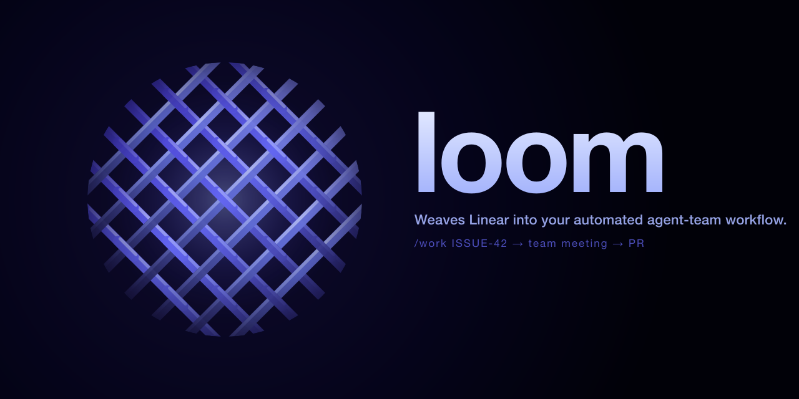

<p align="center">
  
</p>

# loom

Weaves Linear into your automated agent-team workflow.

A Claude Code starter kit that turns any Linear issue into a reviewed PR through a personality-driven dev-team meeting, a paranoid dispatch-review gate, and a single subagent execution pass.

```
/work ISSUE-42
  → pre-flight (branch state, halt signals)
  → team meeting (in-character, multi-agent)
  → Scribe emits dispatch prompt
  → you review + apply dispatch-ok label
  → subagent executes + opens PR
  → CI polled → green → your turn to merge
```

## Quickstart

```bash
# 1. Install the CLI in your project
cd your-project/
npx @juliushamm/loom init
# (answers: team key, branch prefix, signoff email)

# 2. Create Linear labels
export LINEAR_API_KEY=lin_api_...
npx @juliushamm/loom labels --ensure

# 3. Build your dev team
# In Claude Code: invoke the build-team skill to interview you
# about your project and each persona. Writes to
# .claude/skills/<your-team-name>/
```

Then run `/work YOUR-123` on any Linear issue.

## What you get

- **`loom` CLI** — `@juliushamm/loom` on npm. Five pipeline subcommands (`preflight`, `poll-dispatch`, `poll-ci`, `merge-gate`, `cleanup`) plus three setup subcommands (`init`, `labels`, `doctor`).
- **`/work` skill** — Claude Code skill that orchestrates the full pipeline. Reads config from `.loom.json`. Supports two deliverable shapes: **code** (subagent opens a PR; CI is polled) and **Linear Document** (subagent creates/updates a doc on the named project via the Linear MCP; no PR, no file writes).
- **Dev-team template** — a seven-persona skeleton (Lead, Architect, Frontend, Backend, Security, QA, Scribe) that the `build-team` skill fills in via an interactive interview.

## Prerequisites

- Claude Code installed.
- Linear workspace + API key.
- GitHub CLI (`gh`) authenticated.
- Node 20+ and a git repo.

Run `loom doctor` any time to check.

## Configuration

`.loom.json` at your repo root. Minimal:

```json
{
  "linear": { "teamKey": "ACME" }
}
```

Full schema: `schema/v1.json`. Every field other than `linear.teamKey` has a sane default.

## The dispatch-review gate

Every `/work` run pauses before execution. Scribe posts the subagent dispatch prompt as a Linear comment, then `loom poll-dispatch` blocks. You read the prompt and choose:

- **Apply `automation:dispatch-ok` label** → orchestrator unblocks, dispatches the subagent.
- **Apply `automation:dispatch-reject` label** → orchestrator treats as rejected, exits with code 5. Your comment on the issue becomes the revision brief; the orchestrator revises and re-posts.
- **Apply `automation:halt` label** → kill-switch, cleanup runs.

Reject evaluation precedes ok — if both labels are present, reject wins.

## CLI reference

```
loom init                        Interactive config + copy /work skill
loom labels --ensure             Create automation:* labels in Linear
loom labels --dry-run            Preview label creation
loom doctor                      Env + Linear + gh + labels health check
loom preflight   <ISSUE>         Print state machine JSON
loom poll-dispatch <ISSUE>       Block until dispatch-ok / reject / halt
loom poll-ci   <PR> --issue <ISSUE>   Block until CI settles
loom merge-gate <PR> --issue <ISSUE>  Block until PR is merged
loom cleanup   <ISSUE>           Release locks, remove in-flight label
```

Exit codes: `0` ok, `2` usage, `3` halt/timeout, `4` red CI, `5` dispatch-reject.

## Packaging layout

```
loom/
├── packages/cli/         # @juliushamm/loom
├── skills/
│   ├── work/             # /work skill — reads .loom.json
│   └── dev-team-template/  # skeleton consumed by build-team
├── schema/v1.json        # .loom.json JSON Schema
├── examples/sample-consumer/
└── docs/
```

## Known caveats

- Binary name `loom` will collide if another `loom` package is globally installed. Use `npx @juliushamm/loom <subcommand>` when in doubt.
- Linear Cycles are not yet used by `loom` — assignment to a cycle is a manual step.

## License

MIT — see `LICENSE`.
